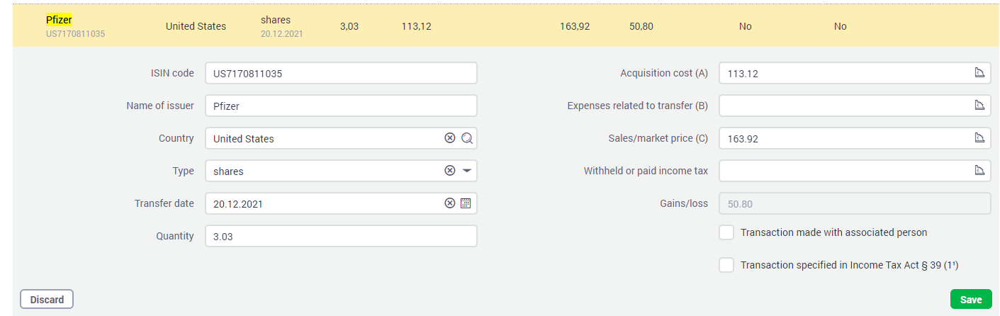

# lightyear-tax-reporting

0. Clone repo
1. Generate statement from Lightyear for 2021 in CSV
- Note: you can generate up to current month as well but USD->EUR rates aren't availabl for all months in 2022 yet
2. Add it to the folder somewhere
3. in `src/pnl.js` set the statement folder correctly

```js
    await readStatement('./statements/LightyearStatement-2021-06-22_2022-04-13.csv', ...)
```

4. node src/pnl.js
5. For every sell you'll get a log line

```
2021-12-20: Sold 3.03763657 shares for €163.923 of PFE, bought for €113.125 (average buying price: €37.241 -- selling price: €53.964 pnl: 50.798
```

6. You fill this in to the tax reporting,

- You still need to look up the ISIN code of the symbol, this is not allowed to be distributes
- Country is also not included in the instrument data, in case of ADRs fill in the country of the HQ
- Quantity, Acquisition Cose and Market Price is in the log, PnL will be recalculated on EMTA

